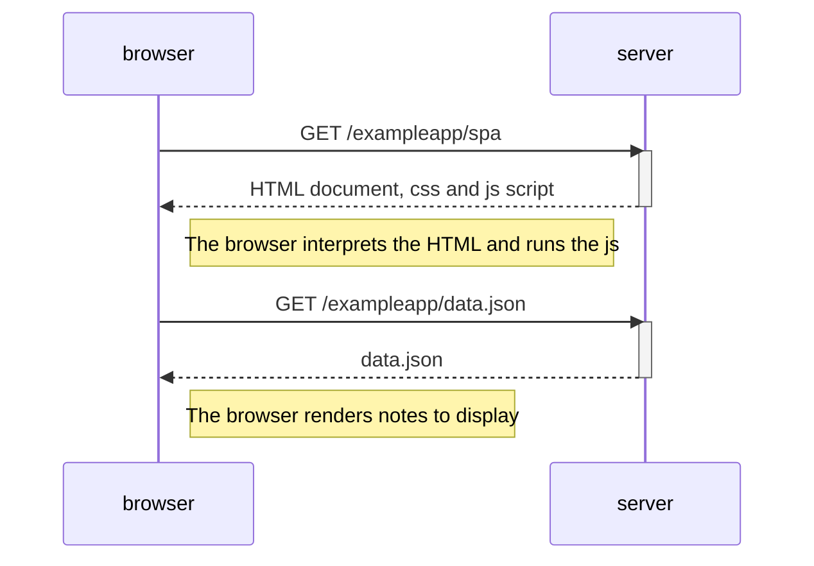

```mermaid
    sequenceDiagram
    participant browser
    participant server
    
    browser->>server: GET /exampleapp/spa
    activate server

    server-->>browser: HTML document, css and js script
    deactivate server

    Note right of browser: The browser interprets the HTML and runs the js

    browser->>server: GET /exampleapp/data.json
    activate server

    server-->>browser: data.json
    deactivate server
    
    Note right of browser: The browser renders notes to display
```
