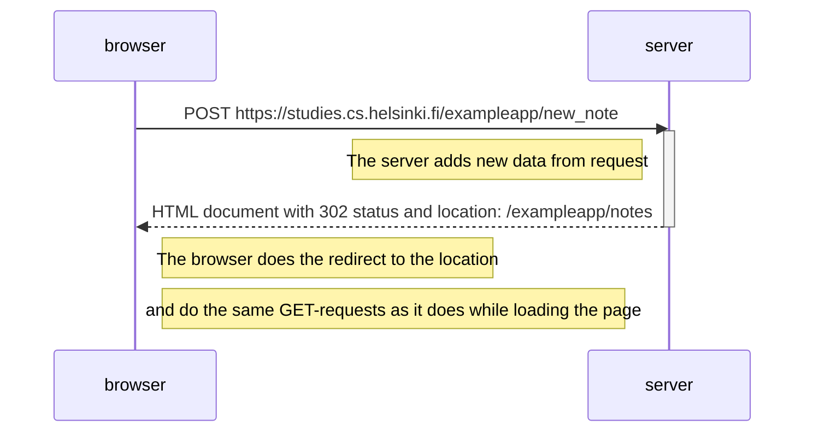

```mermaid
    sequenceDiagram
    participant browser
    participant server
    
    browser->>server: POST https://studies.cs.helsinki.fi/exampleapp/new_note
    activate server

    Note left of server: The server adds new data from request 

    server-->>browser: HTML document with 302 status and location: /exampleapp/notes
    deactivate server

    Note right of browser: The browser does the redirect to the location 
    Note right of browser: and do the same GET-requests as it does while loading the page 
```
